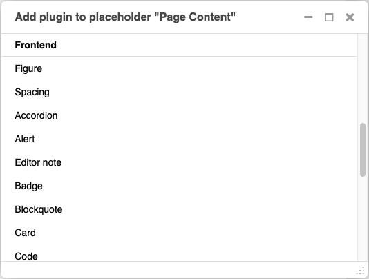
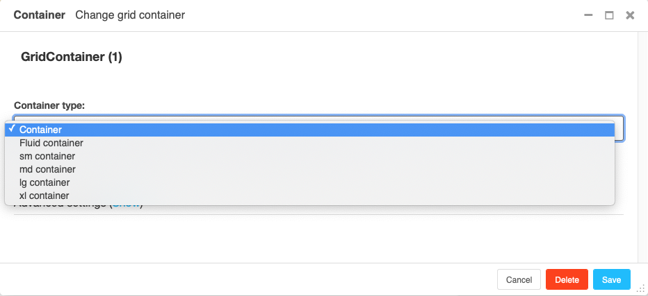
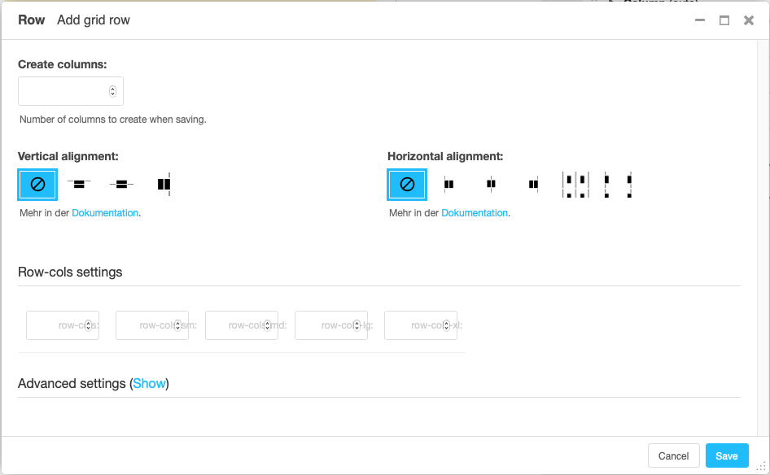
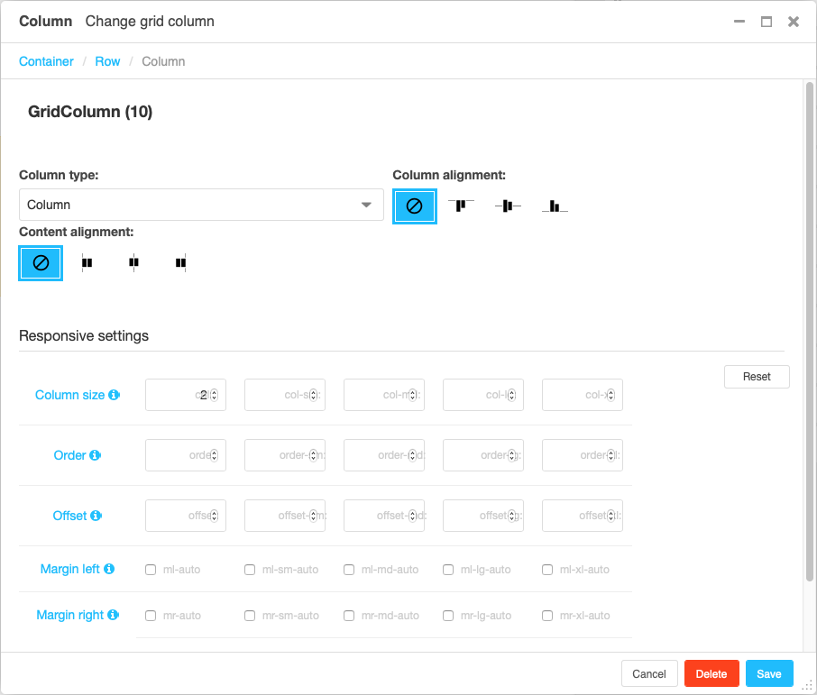
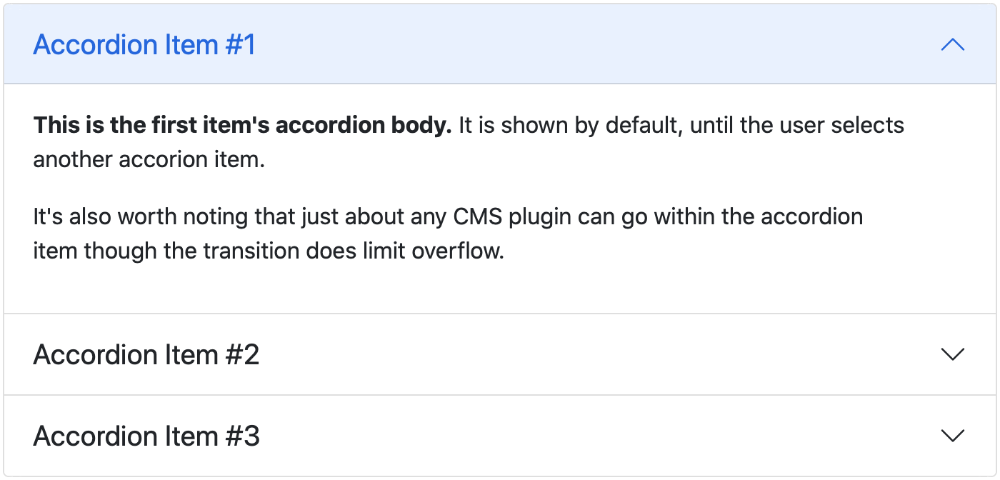
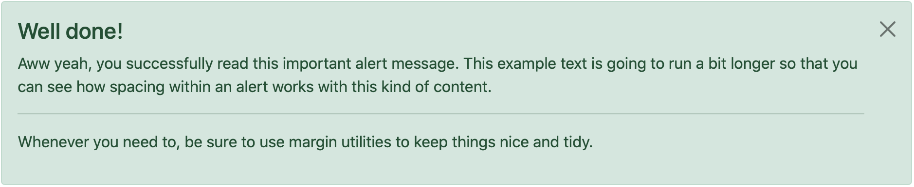
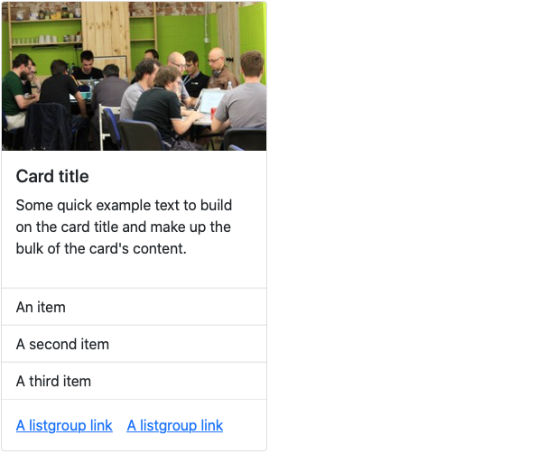
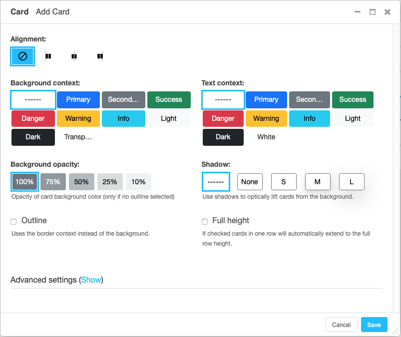
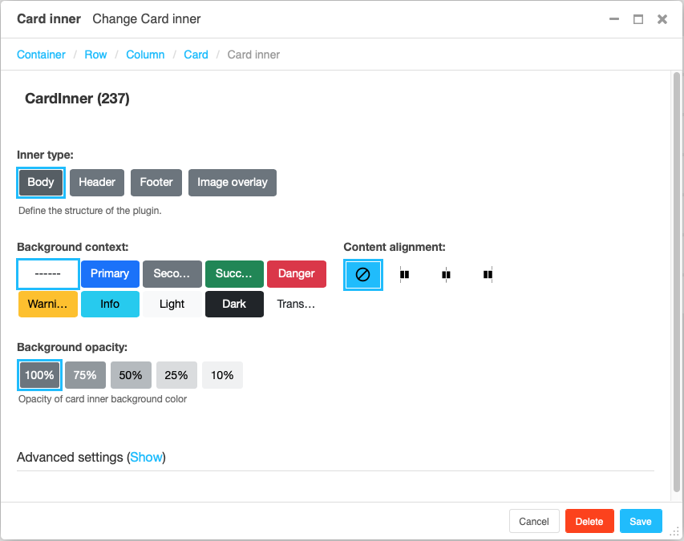

#################
Getting started
#################

.. index::
    single: Installation

**************
Installation
**************

Install package
===============

For a manual install run ``pip install djangocms-frontend``

Alternatively, add the following line to your project's
``requirements.txt``:

.. code::

   djangocms-frontend

Make apps available to your django project
==========================================

Add the following entries to your ``INSTALLED_APPS``:

   .. code::

      'djangocms_icon',
      'djangocms_frontend',
      'djangocms_frontend.contrib.accordion',
      'djangocms_frontend.contrib.alert',
      'djangocms_frontend.contrib.badge',
      'djangocms_frontend.contrib.card',
      'djangocms_frontend.contrib.carousel',
      'djangocms_frontend.contrib.collapse',
      'djangocms_frontend.contrib.content',
      'djangocms_frontend.contrib.grid',
      'djangocms_frontend.contrib.image',
      'djangocms_frontend.contrib.jumbotron',
      'djangocms_frontend.contrib.link',
      'djangocms_frontend.contrib.listgroup',
      'djangocms_frontend.contrib.media',
      'djangocms_frontend.contrib.tabs',
      'djangocms_frontend.contrib.utilities',

Create necessary database table
===============================

Finally, run ``python manage.py migrate``

**djangocms-frontend** now is ready for use!

Adding styles and javascript manually
=====================================

django CMS frontend **does not** automatically add the styles or
javascript files to your frontend, these need to be added at your
discretion.

Out of the box, **djangocms-frontend** is configured to work with
`Bootstrap 5 <https://getbootstrap.com/>`_. Styles should be added to
your ``<head>`` section of your project template (often called
``base.html``). Javascript should be added at the end of the ``<body>``
section or your template. For illustration and an easier start,
**djangocms-frontend** comes with example templates.

.. index::
    single: base.html

Using example templates of djangocms-frontend
=============================================

**djangocms-frontend** comes with example templates. The simplest way to
activate `Bootstrap 5 <https://getbootstrap.com/>`_ is by using the
following base template (``base.html``)

.. code::

   
   <a href="/">My Site</a>

.. note::

    We recommend developing your own ``base.html`` for your projects. The
    example templates load CSS and JS files from a CDN. Good reasons to do so
    are

    * **djangocms-frontend** does not contain CSS or JS files from Bootstrap
      or any other framework for that matter. The example tempaltes load
      CSS and JS from a CDN.
    * It is considered safer to host CSS and JS files yourself. Otherwise you
      do not have control over the CSS and/or JS that is delivered.
    * It is a common practice to customize at least the CSS part, e.g. with
      brand colors.

The example template is customizable by a set of template blocks:

````
    Renders the page title. Defaults to ````

````
    Here goes the main content of the page. The default setup is a ``<section>``
    with a placeholder called "Page Content" and a ``<footer>`` with a static
    placeholder (identical on all pages) called "Footer":

    .. code::

        
            <section>
                
            </section>&nbsp;
            <footer>
                
            </footer>
        

````
    This block renders a navigation bar using the Bootstrap 5 ``navbar`` classes
    and django CMS' menu system. If you need to add additional navigation on
    the right hand side of the nav bar populate the block ``searchbar``
    (which can include a search function but does not have to). Also, the block
    ``brand`` is rendered in the navigation bar.

````
    Loads the framework's CSS. Replace this block if you prefer to include your
    the CSS from your server.

````
    Loads the framework's JS. Replace this block if you prefer to include your
    the JS from your server. JS is loaded **before** ````.

````
    Loads additional JS at the end of the page. Currently empty. This block
    is loaded **after** ````.

````
    Additional CSS placed just before the end of the ``<body>``. Currently empty.

````
    Contains the meta description of the page. Defaults to:

    .. code::

        <meta name="description" content=""/>
        <meta property="og:type" content="website"/>
        <meta property="og:title" content=""/>
        <meta property="og:description" content=""/>

````
    Contains the canonical url of the page. Defaults to:

    .. code::

        <link rel="canonical" href="{{ request.build_absolute_uri }}"/>
        <meta property="og:url" content="{{ request.build_absolute_uri }}"/>

Granting rights
===============

If you have restricted rights for users our groups in your projects make
sure that editors have the right to to add, change, delete, and - of
course - view instances of djangocms_frontend UI item.

Otherwise the plugins will not appear in the editors' frontend.

.. index::
    single: Migration from Bootstrap 4
    single: migrate_frontend
    single: manage.py migrate_frontend

.. _Migrating from djangocms-bootstrap4:

*************************************
 Migrating from djangocms-bootstrap4
*************************************

In the case you have a running django CMS project using
`djangocms-bootstrap4
<https://github.com/django-cms/djangocms-bootstrap4>`_ you can try to
run the automatic migration process. This process converts all plugin
instances of djangocms-bootstrap4 into corresponding djangocms-frontend
plugins.

.. note::

   Bootstrap 4 and Bootstrap 5 differ, hence even a  successful
   migration will require manual work to fix differences. The migration
   command is a support to reduce the amount of manual work. It will not
   do everything automatically!

   The more your existing installation uses the attributes field (found
   in "advanced settings") the more likely it is, that you will have to
   do some manual adjustment. While the migration command does adjust
   settings in the attributes field it cannot know the specifics of
   your project.

.. attention::

   Please do **back up** your database before you do run the management
   command!

For this to work, the both the djangocms-frontend **and** the
djangocms-bootstrap4 apps need to be included in ``INSTALLED_APPS``.

.. code::

   ./manage.py migrate_frontend

After you finish the migration you can remove all djangocms-bootstrap4
apps from ``INSTALLED_APPS`` and you may delete the now empty database
tables of djangocms-bootstrap4. You identify them by their name pattern:

.. code::

   bootstrap4_alerts_bootstrap4alerts
   bootstrap4_badge_bootstrap4badge
   ...
   bootstrap4_utilities_bootstrap4spacing

.. index::
    single: Plugins

**************
 Grid plugins
**************

All plugins are listed in the section "Frontend" when adding a plugin to
a placeholder:

For details on how grids work, see, e.g. the `Bootstrap 5 documentation
<https://getbootstrap.com/docs/5.1/layout/grid/>`_.

.. index::
    single: Container

Container
=========

A container is an invisible element that wraps other content. There are
in two types of containers:

Container
   All other containers restrict the width of their content depending on
   the used device.

Fluid container
   A fluid container occupies the full width available - no matter how
   wide the viewport (or containing) element is.

Full container
   A full container is like a fluid container and occupies the full width
   available. Additionally, it does not have a padding. Its content can
   therefore fill the entire area. Full containers are useful if you want
   to add a background color or shadow to another DOM element, like, e.g.,
   the contents of a column.

.. note::

    New feature:
        Containers can have a background color ("context"), opacity and shadow.

.. index::
    single: Row

.. _Grid plugins:

Row
===

A row contains one or more columns. By default columns are displayed
next to each other.

To automatically create not only a row but also some columns within that
row, enter the number of columns you will be using. You can always later
add more columns to the row or delete columns from the row.

Vertical alignmend defines how columns of different height are
positioned against each other.

Horizontal alignment defines how columns **that do not fill an entire
row** are distributed horizontally.

.. note::

    New feature:

        The section "Row-cols settings" defines how many columns should be next
        to each other for a given display size. The "row-cols" entry defines the
        number of columns on mobile devices (and above if no other setting is
        given), the "row-cols-xl" entry the number of columns on a xl screen.

.. index::
    single: Column

Column
======

The column settings is largely about how much of the grid space the
column will use horizontally. To this end, the grid is divided in
(usually) 12 strips of equal width.

Auto sizing
   If no information on the column size is given, the column will be
   autosizing. This means that all autosizing columns of a row will
   occupy the same fraction of the space left, e.g. by sized columns.

Specifically sized columns
   If you enter a number the column for the specific screen size will
   exactly have the specified width. The unit of width is one twelfth of
   the surrounding's row width.

Natural width:
    If you need a column to take its natural width, enter ``0`` for its
    column size.

Also, you can adjust the vertical alignment of the specific column from
the row's default setting.

Finally, you can set the alignment of the content to left (right in a
rtl environment), center or right (left in a rtl environment). This
comes handy if, e.g., the column is supposed to contain centered
content.

.. note::

    Removed:
        The column type entry has been removed since it was a legacy from
        Bootstrap version 3.

*******************
 Component plugins
*******************

``djangocms-frontend`` adds a set of plugins to Django-CMS to allow for
quick usage of components defined by the underlying css framework, e.g.
bootstrap 5.

While ``djangocoms-frontend`` is set up to become framework agnostic its
heritage from ``djangocms-bootstrap4`` is intentionally and quite visible.
Hence  for the timne being, this documentation references the Bootstrap 5
documentation.

.. index::
    single: Accordion

Accordion component
===================

Build vertically collapsing sections using accordions:

Accordions consist of an Accordion plugin which has an Accordion Item plugin for
each collapsable section.

.. image:: screenshots/accordion-plugins.png
    :width: 394

Also see Bootstrap 5 `Accordion <https://getbootstrap.com/docs/5.0/components/accordion/>`_
documentation.

.. index::
    single: Alert

Alert component
===============

Alerts provide contextual feedback messages for typical user actions with a
handful of available alert messages.

Alerts can be marked dismissible which implies that a close button is added on
the right hand side.

.. image:: screenshots/alert-plugins.png
    :width: 391

.. note::

    New features:
        Alerts can have **shadows** to optically lift them.

Also see Bootstrap 5 `Alerts <https://getbootstrap.com/docs/5.0/components/alerts/>`_
documentation.

.. index::
    single: Badge

Badge component
===============

Badges are small count and labeling components usually in headers and buttons.

While often useful if populated automatically as opposed to statically in a
plugin, badges are useful, e.g., to mark featured or new headers.

Also see Bootstrap 5 `Badge <https://getbootstrap.com/docs/5.0/components/badge/>`_
documentation.

.. index::
    single: Card
    single: CardInner
    single: CardLayout

Card component
==============

A card is a flexible and extensible content container. It includes options for
headers and footers, a wide variety of content, contextual background colors,
and powerful display options.

A card consists of the card wrapper itself, the Card Plugin. It can contain
one ore more instances of a Card Inner Plugin for header, body or footer, but
also potentially an Image Plugin for the card image or list group components.

The corresponding plugin tree is here:

.. image:: screenshots/card-plugins.png
    :width: 825

Cards can be grouped by a **Card Layout component** offering the ability group
cards or display a grid of cards. The latter can be controlled by responsive
tools. If you need more granular responsive settings, please revert to
:ref:`Grid plugins <Grid plugins>` and build your own custom grid.

.. warning::

    djangocms-bootstrap4 Card Decks are not supported by `Bootstrap 5
    <https://getbootstrap.com/docs/5.1/components/card/#card-layout>`_.
    Card decks will be converted to grids of cards upon
    :ref:`Migrating from djangocms-bootstrap4`.

Card
----

The card resides in a Card plugin which allows for coloring, opacity and shadow
options.

Content is added to the card plugin by creating child plugins. These can be of
the type `Card inner`_, `Picture / Image`_, `List group`_, or `Row`_.

.. note::

    New feature:
        By adding iamges or list groups directly to a card, unnecessary
        margins are avoided.

Card inner
----------

The Card Inner plugin allows to add the card header, body, footer or an overlay
space for a card image.

Here is an example of the new card overlay feature:

.. image:: screenshots/card-overlay-example.png
    :width: 298

Also see Bootstrap 5 `Card <https://getbootstrap.com/docs/5.0/components/card/>`_
documentation.

.. index::
    single: Carousel

Carousel component
==================

A `Carousel <https://getbootstrap.com/docs/5.0/components/carousel/>`_
is a set of images (pontentially with some description) that slide in
(or fade in) one after the other after a certain amount of time.

Collapse component
==================

The `Collapse <https://getbootstrap.com/docs/5.0/components/collapse/>`_
hides text behind its headline and offers the user a trigger (e.g., a
button) to reveal itself.

Compared to the accordion component the collapse component often is more
flexible but also requires more detailed styling.

.. index::
    single: Jumbotron

Jumbotron component
===================

The jumbotron component is a large header.

.. note::

    The jumbotron header is not reflected
    by the table of contents component.

.. index::
    single: Link
    single: Button

Link / Button component
=======================

The link / button plugin creates a styled link or button (using the ``<a>``
HTML tag).

It is designed to allow for external and internal links. Internal links point
to a CMS page or pages of other Django applications. They are dynamic, i.e. if
the page's url changes (e.g. because it is moved in the page tree) all links
pointing to the page change accordingly.

.. note::

    **djangocms-frontend** uses django-cms' function ``get_page_choices(lang)``
    to get the list of available pages in the current language.

The developer can extend the list of available internal link targets to pages
outside the CMS page tree using the
``DJANGOCMS_FRONTEND_LINK_MODELS`` setting in the project's ``.settings`` file.
The link/button
component can point to any page controlled by a Django model if the model class
implements the ``get_absolute_url`` method. A typical use case would, e.g.,
blog entries of `djangocms-blog <https://github.com/nephila/djangocms-blog>`_.
(This approach was inspired by mkoisten's `djangocms-styledlink
<https://github.com/mkoistinen/djangocms-styledlink>`_.)

For more information, see
:ref:`How to add internal link targets outside of the CMS`

List group component
====================

List groups are a flexible and powerful component for displaying a series of
content. Modify and extend them to support just about any content within.

The component consists of a wrapper - ListGroup Plugin - and the items of the
list - ListGroupItem Plugin. If the list item is a link it suffices to instert
a Link Plugin directly as a child of the ListGroup Plugin.

List group
----------

Media component
===============

The media component is another legacy component from djangocms-bootstrap4.
**djangocms-frontend** recreates it using responsive utilities.

.. index::
    single: Picture
    single: Image

.. _Picture / Image:

Picture / image component
=========================

The image or picture component make responsive picture uploads available as
well as responsive embedding of external pictures.

.. index::
    single: Spacing
    single: Spacer

Spacing component
=================

.. index::
    single: Blockquote

Blockquote component
====================

.. index::
    single: Code

Code component
==============

Very nice to have code snippets on your site, either inline or as a code block.

.. index::
    single: Figure

Figure component
================

.. index::
    single: Tabs

Tabs component
==============

*******
 Forms
*******

.. note::

   The form app is not yet finished. Please stay tuned.
