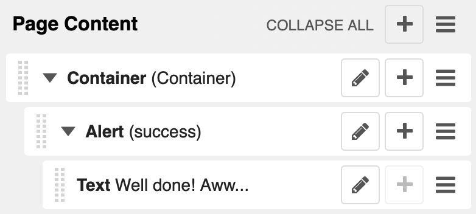

.. index::
    single: Plugins

###################
 Component plugins
###################

``djangocms-frontend`` adds a set of plugins to Django-CMS to allow for
quick usage of components defined by the underlying css framework, e.g.
bootstrap 5.

While ``djangocoms-frontend`` is set up to become framework agnostic its
heritage from ``djangocms-bootstrap4`` is intentionally and quite visible.
Hence  for the time being, this documentation references the Bootstrap 5
documentation.

.. index::
    single: Accordion

*******************
Accordion component
*******************

Build vertically collapsing sections using accordions:

.. image:: screenshots/accordion-example.png

Accordions consist of an Accordion plugin which has an Accordion Item plugin for
each collapsable section.

.. image:: screenshots/accordion-plugins.png
    :width: 394

Also see Bootstrap 5 `Accordion <https://getbootstrap.com/docs/5.3/components/accordion/>`_
documentation.

.. index::
    single: Alert

***************
Alert component
***************

Alerts provide contextual feedback messages for typical user actions with a
handful of available alert messages.

.. image:: screenshots/alert-example.png

Alerts can be marked dismissible which implies that a close button is added on
the right hand side.

.. note::

    New features:
        Alerts can have **shadows** to optically lift them.

Also see Bootstrap 5 `Alerts <https://getbootstrap.com/docs/5.3/components/alerts/>`_
documentation.

.. index::
    single: Badge

***************
Badge component
***************

Badges are small count and labeling components usually in headers and buttons.

While often useful if populated automatically as opposed to statically in a
plugin, badges are useful, e.g., to mark featured or new headers.

.. image:: screenshots/badge-example.png
    :width: 180

Also see Bootstrap 5 `Badge <https://getbootstrap.com/docs/5.3/components/badge/>`_
documentation.

.. index::
    single: Card
    single: CardInner
    single: CardLayout

**************
Card component
**************

A card is a flexible and extensible content container. It includes options for
headers and footers, a wide variety of content, contextual background colors,
and powerful display options.

A card consists of the card wrapper itself, the Card Plugin. It can contain
one ore more instances of a Card Inner Plugin for header, body or footer, but
also potentially an Image Plugin for the card image or list group components.

.. image:: screenshots/card-example.png

The corresponding plugin tree is here:

.. image:: screenshots/card-plugins.png
    :width: 825

Cards can be grouped by a **Card Layout component** offering the ability group
cards or display a grid of cards. The latter can be controlled by responsive
tools. If you need more granular responsive settings, please revert to
:ref:`Grid plugins <Grid plugins>` and build your own custom grid.

.. warning::

    djangocms-bootstrap4 Card Decks are not supported by `Bootstrap 5
    <https://getbootstrap.com/docs/5.1/components/card/#card-layout>`_.
    Card decks will be converted to grids of cards upon
    :ref:`Migrating from djangocms-bootstrap4`.

Card
====

The card resides in a Card plugin which allows for coloring, opacity and shadow
options.

.. image:: screenshots/card.png

Content is added to the card plugin by creating child plugins. These can be of
the type `Card inner`_, `Picture / Image`_, `List group`_, or Row.

.. note::

    New feature:
        By adding images or list groups directly to a card, unnecessary
        margins are avoided.

Card inner
==========

The Card Inner plugin allows to add the card header, body, footer or an overlay
space for a card image.

.. image:: screenshots/card-inner.png

Here is an example of the new card **Image overlay** feature:

.. image:: screenshots/card-overlay-example.png
    :width: 298

Also see Bootstrap 5 `Card <https://getbootstrap.com/docs/5.3/components/card/>`_
documentation.

.. index::
    single: Carousel

******************
Carousel component
******************

A `Carousel <https://getbootstrap.com/docs/5.3/components/carousel/>`_
is a set of images (potentially with some description) that slide in
(or fade in) one after the other after a certain amount of time.

Each slide requires a Carousel Slide child plugin. The simplest case specifies an image, potentially a caption and a link which is followed once the slide is clicked.

Since the design of carousels is somewhat opinionated template sets can be specified using the ``DJANGOCMS_FRONTEND_CAROUSEL_TEMPLATES`` setting.
.. note:: A Carousel Slide plugin can have child plugins itself. If an image is specified the child plugins add to the caption. If no image is specified the child plugins make up the slide.

******************
Collapse component
******************

The `Collapse <https://getbootstrap.com/docs/5.3/components/collapse/>`_
hides text behind its headline and offers the user a trigger (e.g., a
button) to reveal itself.

Compared to the accordion component the collapse component often is more
flexible but also requires more detailed styling.

.. index::
    single: Jumbotron

*******************
Jumbotron component
*******************

The jumbotron component is a large header, used e.g. as a page header. It has been
part of Bootstrap 4 and is still supported as a convenient way to generate page
headers.

.. note::

    The jumbotron header is not reflected by the table of contents component.

.. index::
    single: Link
    single: Button

***********************
Link / Button component
***********************

The link / button plugin creates a styled link or button (using the ``<a>``
HTML tag).

It is designed to allow for external and internal links. Internal links point
to a CMS page or pages of other Django applications. They are dynamic, i.e. if
the page's url changes (e.g. because it is moved in the page tree) all links
pointing to the page change accordingly.

.. note::

    **djangocms-frontend** uses django-cms' function ``get_page_choices(lang)``
    to get the list of available pages in the current language.

The developer can extend the list of available internal link targets to pages
outside the CMS page tree using the
``DJANGOCMS_FRONTEND_LINK_MODELS`` setting in the project's ``.settings`` file.
The link/button
component can point to any page controlled by a Django model if the model class
implements the ``get_absolute_url`` method. A typical use case would, e.g.,
blog entries of `djangocms-blog <https://github.com/nephila/djangocms-blog>`_.
(This approach was inspired by mkoisten's `djangocms-styledlink
<https://github.com/mkoistinen/djangocms-styledlink>`_.)

For more information, see
:ref:`How to add internal link targets outside of the CMS`

.. note::

    Only those destinations (outside the CMS) are shown for which a model admin
    is registered and the logged in user has view permissions: A user will only
    see a destination if they can view it in the admin site.

********************
List group component
********************

List groups are a flexible and powerful component for displaying a series of
content. Modify and extend them to support just about any content within.

The component consists of a wrapper - ListGroup Plugin - and the items of the
list - ListGroupItem Plugin. If the list item is a link it suffices to insert
a Link Plugin directly as a child of the ListGroup Plugin.

List group
==========

The only setting is the list group flush setting. If checked, the list group will
be rendered without borders to blend into the surrounding element, e.g. a card.

List group item
===============

Simple content can be specified by providing "One line content". More complex content
of a list group item is rendered by child plugins. If child plugins are available
the "one line content" is ignored.

List group items can have a context (color), and three state: Regular, active and
disabled.

.. note::

    New feature:
        Links can be added to list groups and automatically are interpreted as list
        group items.

***************
Media component
***************

The media component is another legacy component from djangocms-bootstrap4.
**djangocms-frontend** recreates it using responsive utilities.

.. index::
    single: Picture
    single: Image

.. _Picture / Image:

*************************
Picture / image component
*************************

The image or picture component make responsive picture uploads available as
well as responsive embedding of external pictures.

.. index::
    single: Spacing
    single: Spacer

*****************
Spacing component
*****************

The spacing component provides horizontal and/or vertical spacing. If used without child
plugins it just provides the amount of space specified on the specified sides.

.. note::

    If no spacing is selected the spacing component can be used to individually
    style the content using the attributes fields in "Advanced Settings".

.. index::
    single: Blockquote

********************
Blockquote component
********************

Creates a ``<blockquote>`` tag.

.. note::

    New feature:
        Alternatively to the un-formatted quote text, child plugins can be used
        to fill the content of the blockquote.

.. index::
    single: Code

**************
Code component
**************

Have code snippets on your site using this plugin, either inline or as a code block.
djangocms-frontend offers the `ace code editor <https://ace.c9.io>`_
to enter code bits.

.. warning::
    By default the ace code editor javascript code is retrieved over the internet
    from a cdn. If you do not want this to happen, e.g., for data privacy reasons
    or because your system is not connected to the internet, please use the
    weak dependency on `djangocms-static-ace <https://github.com/django-cms/djangocms-static-ace>`_
    by chaning your requirement from ``djangocms-frontend`` to
    ``djangocms-frontend[static-ace]`` and include
    ``"djangocms_static_ace"`` in your ``INSTALLED_APPS``.

.. index::
    single: Figure

****************
Figure component
****************

The figure component supplies a wrapper and a caption for a figure. The figure
itself is placed inside the figure component (as child plugins).

.. index::
    single: Tabs

**************
Tabs component
**************

.. note::

    Bootstrap 5 comes with a fade animation. Additional animations will have to
    be provided by you or a third party. If you use a CSS animation library,
    you can make these animations available by adjusting the
    ``DJANGOCMS_FRONTEND_TAB_EFFECTS`` setting.

.. index::
    single: Icon

**************
Icon component
**************

.. versionadded:: 1.1

djangocms-frontend's icon plugin supports a variety of popular icon fonts. The icon component is centered around Gilles Migliori's `universal icon picker <https://github.com/migliori/universal-icon-picker>`_.

A version of it is bundled with djangocms-frontend. It currently contains support for the following icon sets:

* `Bootstrap icons <https://icons.getbootstrap.com>`_
* Elegant icons
* Feather icons
* Fomatic UI icons
* `Font awesome (regular, solid and brands) <https://fontawesome.com>`_
* `Foundation icons <https://zurb.com/playground/foundation-icon-fonts-3>`_
* Happy icons
* Icomoon
* `Material icons (filled, outlined, sharp, two-tone) <https://fonts.google.com/icons>`_
* Open iconic
* Tabler icons
* Weather icons
* Steve Schoger's `Zondicons <https://www.zondicons.com/icons.html>`_

.. note::

    The icon picker needs a config file for each icon set. This requires regular update. Please be patient if new icons do not appear immediately in djangocms-frontend's icon picker.

.. warning::

    You may either use djangocms-icon or djangocms-frontent's icon contrib package but not both, since they both register an ``IconPlugin``.
