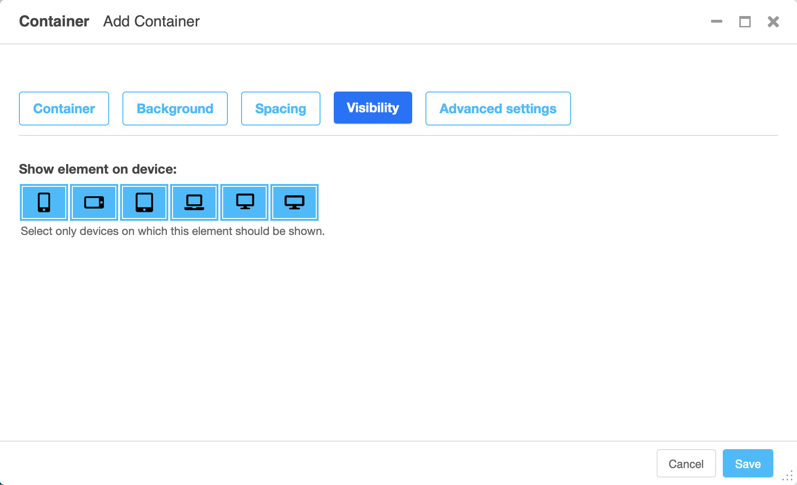

#################
Getting started
#################

.. index::
    single: Installation

**************
Installation
**************

Install package
===============

For a manual install run ``pip install djangocms-frontend``

Alternatively, add the following line to your project's
``requirements.txt``:

.. code::

   djangocms-frontend

**djangocms-frontend** has weak dependencies you can install separately or
by adding an option:

.. code::

    djangocms-frontend[djangocms-icon]  # Installs djangocms-icon for icons support in links
    djangocms-frontend[static-ace]  # Installs djangocms-static-ace to include the ace code editor in static files
    djangocms-frontend[static-ace, djangocms-icon]  # comma-separate multiple dependencies

``djangocms-frontend[static-ace]`` is useful if your project cannot or should not
access a CDN to load the `ace code editor <https://ace.c9.io>`_ for the code plugin.
Please be sure to in this case also add ``"djangocms_static_ace"`` to your
project's ``INSTALLED_APPS``.

Make apps available to your django project
==========================================

Add the following entries to your ``INSTALLED_APPS``:

   .. code::

      "djangocms_icon",  # optional
      "easy_thumbnails",
      "djangocms_frontend",
      "djangocms_frontend.contrib.accordion",
      "djangocms_frontend.contrib.alert",
      "djangocms_frontend.contrib.badge",
      "djangocms_frontend.contrib.card",
      "djangocms_frontend.contrib.carousel",
      "djangocms_frontend.contrib.collapse",
      "djangocms_frontend.contrib.component",
      "djangocms_frontend.contrib.content",
      "djangocms_frontend.contrib.grid",
      "djangocms_frontend.contrib.icon",
      "djangocms_frontend.contrib.image",
      "djangocms_frontend.contrib.jumbotron",
      "djangocms_frontend.contrib.link",
      "djangocms_frontend.contrib.listgroup",
      "djangocms_frontend.contrib.media",
      "djangocms_frontend.contrib.tabs",
      "djangocms_frontend.contrib.utilities",

Create necessary database table
===============================

Finally, run ``python manage.py migrate``

**djangocms-frontend** now is ready for use!

Adding styles and javascript manually
=====================================

django CMS frontend **does not** automatically add the styles or
javascript files to your frontend, these need to be added at your
discretion.

Out of the box, **djangocms-frontend** is configured to work with
`Bootstrap 5 <https://getbootstrap.com/>`_. Styles should be added to
your ``<head>`` section of your project template (often called
``base.html``). Javascript should be added at the end of the ``<body>``
section or your template. For illustration and an easier start,
**djangocms-frontend** comes with example templates.

.. index::
    single: base.html

Using example templates of djangocms-frontend
=============================================

**djangocms-frontend** comes with example templates. The simplest way to
activate `Bootstrap 5 <https://getbootstrap.com/>`_ is by using the
following base template (``base.html``)

.. code::

   
   <a href="/">My Site</a>

.. note::

    We recommend developing your own ``base.html`` for your projects. The
    example templates load CSS and JS files from a CDN. Good reasons to do so
    are

    * **djangocms-frontend** does not contain CSS or JS files from Bootstrap
      or any other framework for that matter. The example templates load
      CSS and JS from a CDN.
    * It is considered safer to host CSS and JS files yourself. Otherwise you
      do not have control over the CSS and/or JS that is delivered.
    * It is a common practice to customize at least the CSS part, e.g. with
      brand colors.

The example template is customisable by a set of template blocks:

````
    Renders the page title. Defaults to ````

````
    Here goes the main content of the page. The default setup is a ``<section>``
    with a placeholder called "Page Content":

    .. code::

        
            <section>
                
            </section>
        

````
    This block renders a navigation bar using the Bootstrap 5 ``navbar`` classes
    and django CMS' menu system. If you need to add additional navigation on
    the right hand side of the nav bar populate the block ``searchbar``
    (which can include a search function but does not have to). Also, the block
    ``brand`` is rendered in the navigation bar.

````
    Loads the framework's CSS. Replace this block if you prefer to include your
    the CSS from your server.

````
    Loads the framework's JS. Replace this block if you prefer to include your
    the JS from your server. JS is loaded **before** ````.

````
    Loads additional JS at the end of the page. Currently empty. This block
    is loaded **after** ````.

````
    Additional CSS placed just before the end of the ``<body>``. Currently empty.

````
    Contains the meta description of the page. Defaults to:

    .. code::

        <meta name="description" content=""/>
        <meta property="og:type" content="website"/>
        <meta property="og:title" content=""/>
        <meta property="og:description" content=""/>

````
    Contains the canonical url of the page. Defaults to:

    .. code::

        <link rel="canonical" href="{{ request.build_absolute_uri }}"/>
        <meta property="og:url" content="{{ request.build_absolute_uri }}"/>

Granting rights
===============

If you have restricted rights for users our groups in your projects make
sure that editors have the right to to add, change, delete, and - of
course - view instances of all djangocms_frontend UI items:

* Accordion
* Alert
* Badge
* Card
* Carousel
* Collapse
* Content
* Forms
* Grid
* Icon
* Image
* Jumbotron
* Link
* Listgroup
* Media
* Tabs
* Utilities

Otherwise the plugins will not be editable and will not appear in the editors'
plugin selection when adding a plugin in the frontend.

Since changing them for each of the plugins manually can become tiresome a
management command can support you.

**First** manually define the permissions for the model ``FrontendUIItem`` of
the app ``djangocms_frontend``. **Then** you can synchronize
all permissions of the installed UI items by typing

.. code-block::

    ./manage.py frontend sync_permissions users
    ./manage.py frontend sync_permissions groups

These commands transfer the permissions for ``FrontendUIItem`` to all installed
plugins for each user or group, respectively.

The first command is only necessary of you define by-user permissions. Depending
on the number of users it may take some time.

.. attention::

    If in doubt, please make a backup of your database tables. This operation
    cannot be undone!

.. index::
    single: Migration from Bootstrap 4
    single: migrate
    single: manage.py

.. _Migrating from djangocms-bootstrap4:

*************************************
 Migrating from djangocms-bootstrap4
*************************************

In the case you have a running django CMS project using
`djangocms-bootstrap4
<https://github.com/django-cms/djangocms-bootstrap4>`_ you can try to
run the automatic migration process. This process converts all plugin
instances of djangocms-bootstrap4 into corresponding djangocms-frontend
plugins.

.. note::

   Bootstrap 4 and Bootstrap 5 differ, hence even a  successful
   migration will require manual work to fix differences. The migration
   command is a support to reduce the amount of manual work. It will not
   do everything automatically!

   The more your existing installation uses the attributes field (found
   in "advanced settings") the more likely it is, that you will have to
   do some manual adjustment. While the migration command does adjust
   settings in the attributes field it cannot know the specifics of
   your project.

.. attention::

   Please do **back up** your database before you do run the management
   command!

For this to work, the both the djangocms-frontend **and** the
djangocms-bootstrap4 apps need to be included in ``INSTALLED_APPS``.

.. warning::

    The order of the apps in ``INSTALLED_APPS`` is **cruicial**.

    1. First is ``djangocms_link`` and ``djangocms_icon`` the first of which is needed by ``djangocms_bootstrap4``,
    2. then come all ``djangocms_bootstrap4`` plugins.
        ``djangocms_bootstrap4.contrib.bootstrap4_link`` uninstalls the Link
        plugin of ``djangocms_link``
    3. At last come all ``djangocms_frontend`` apps.

.. warning::

    The migration process does also migrate ``djangocms-icon`` instances to ``djangocms-frontend``. If you prefer to use ``djangocms-icon`` instead, remove ``"djangocms_frontend.contrib.icon"`` from installed apps.

.. code::

   ./manage.py cms delete-orphaned-plugins
   ./manage.py migrate
   ./manage.py frontend migrate

The migration process displays a counter indicating how many plugins were
converted (an integer like `2133` depending how many bootstrap4 plugins you have.):

        Migrating plugins
        =================
        Migrated 2133 plugins.
        Successfully migrated plugins.

        Checking installed apps for potential link destinations
        =======================================================
        No further link destinations found. Setup complete.

In the case that no plugins were migrated the output looks very similar but does
not contain the counter.

        Migrating plugins
        =================
        Nothing to migrate

        Checking installed apps for potential link destinations
        =======================================================
        No further link destinations found. Setup complete.

Only plugins managed by apps listed in ``INSTALLED_APPS`` will be migrated.

.. warning::

    Spin up your development server and test at this point if the migration
    has succeeded. Open a former djangocms-bootstrap4 plugin and check that
    it has the appearance of a dajngocms-frontend plugin.

Therefore only after you finish the migration you can remove all
djangocms-bootstrap4 apps **and** ``djangocms_link`` from ``INSTALLED_APPS``
and you may delete the now empty database tables of djangocms-bootstrap4.
You identify them by their name pattern:

.. code::

   bootstrap4_alerts_bootstrap4alerts
   bootstrap4_badge_bootstrap4badge
   ...
   bootstrap4_utilities_bootstrap4spacing

************************
Using djangocms-frontend
************************

**djangocms-frontend** offers a set of plugins to allow for an easy and clean
structure of your CMS contents.

All plugins are listed in the section "Frontend" when adding a plugin to
a placeholder:

.. image:: screenshots/add_plugin.png

Frontend editing of plugins has been updated compared to **djangocms-bootstrap4**
with three aims:

* Keep the essential editing required minimal and well-arranged on the editing
  forms.
* Eliminate the need for regularly adding html classes or other attributes like
  styles.
* Keep the possibility to change the html classes or tags in the rare case it
  is needed.

The editing has therefore been categorized in tabs starting with a plugin's
key tab for its most important information. Other tabs add general modifications
to the plugin, their availability depending on the plugin type. The well-known
"advanced settings" is available to all plugins, however, its use should in most
case be covered by the new other tabs:

.. image:: screenshots/tabs-main.png

Background tab
==============

The background tab allows to set a background context leading to the background
being colored appropriately.

The background properties can be modified by changing **opacity** and its ability
cast a **shadow**. Shadows allow the whole element to appear elevated from the
background.

.. image:: screenshots/tabs-background.png

Spacing tab
===========

The spacing tab is used to set margins and padding and to select which
devices they should be applied.

For both margin and padding the settings can be made independently for
horizontal and vertical padding.

.. image:: screenshots/tabs-spacing.png

Visibility tab
==============

The visibility tab controls on which devices the elements and its children
should be visible. Use this to design different content for different devices.

Advanced settings tab
=====================

The advanced tab lets you chose which tag (typically a ``div``) should be used
to render the element. You may also add attributes like additional classes as a
``class`` attribute, an ``id`` or styles in the ``style`` attribute.

.. image:: screenshots/tabs-advanced.png

.. warning::

    Using the advanced tab requires some technical knowledge on the sites
    installation, e.g., what css classes are available. This is why the advanced
    settings tab should only be used rarely. If you find yourself using it
    regularly, extending **djangocms-frontend** using a theme might be the more
    editor-friendly and more maintainable solution.

The advanced tab label carries a blue-ish dot to indicate that attributes are
set in the advanced settings tab. These attributes can change the appearance of
the element significantly which is why the dot reminds the editor that
there are advanced settings present.

.. image:: screenshots/adv-settings-active.png

Error indicators
================

In case the form is not valid when the user tries to save all fields that
are marked invalid will have an error message attached. Since not all fields
are visible in tabbed editing tabs containing an error have a red badge at
the upper right corner:

.. image::  screenshots/tab-error-indicator.png

.. _components:

Using frontend plugins as components in templates
=================================================

.. versionadded:: 2.0

The plugins of **djangocms-frontend** can be used as components in your
templates - even in apps that do not use or integrate with djanog CMS
otherwise. This is useful if you want use exactly the same markup for, say,
buttons, links, the grid both in pages managed with django CMS and in
other parts of your project without duplicating HTML code.

This feature introduces a simple and flexible way to re-use djangocms-frontend
plugins directly in templates without needing to create database entries for
them. This allows developers to maintain clean, reusable, and dynamic
components, such as buttons, cards, links, and more, while minimizing code
repetition.

To use a frontend plugin in a template you need to load the ``frontend`` tags
and then use the ``plugin`` template tag to render a frontend plugin.

.. code::

    
    
        Here goes the content of the alert.
    

The plugins will be rendered based on their standard attribute settings.
You can override these settings by passing them as keyword arguments to the
``plugin`` template tag.

You can also create more complex reusable components, like a card with inner
elements such as headers, bodies, and lists, by nesting plugins. Here’s an
example of a card component::

    
    
        
            <h4>Card title</h4>
        
        
            Some quick example text to build on the card title and make up the bulk of the card's content.
        
        An item
        A second item
        A third item
    

Breakdown of the Code:

* ``plugin "card"``: Creates the outer card component.
    * ``card_alignment="center"``: Aligns the card content to the center.
    * ``card_outline="info"``: Gives the card an "info" outline style.
    * ``card_text_color="primary"``: Changes the text color to "primary."
    * ``card_full_height=True``: Ensures the card takes up the full height of its container.
* Nested ``plugin "cardinner"``: Creates inner components within the card.
    * ``inner_type="card-header"``: Specifies a header section for the card.
    * ``text_alignment="start"``: Aligns the header text to the start (left).
* Additional nested ``plugin "cardinner"`` and ``listgroupitem``:
* These create the body of the card and a list group inside the card.

The above template generates a dynamic card component with a header, a body,
and a list group that can be reused across multiple pages without requiring
database entries.

For more examples, see the documentation of the djanog CMS plugins on of how to
use the ```` template tag with each plugin.

.. note::

    While this is designed for **djangocms-frontend** plugins primarily, it
    will work with many other django CMS plugins.

    Since no plugins are created in the database, plugins relying on their
    instances being available in the database will potentially not work.

