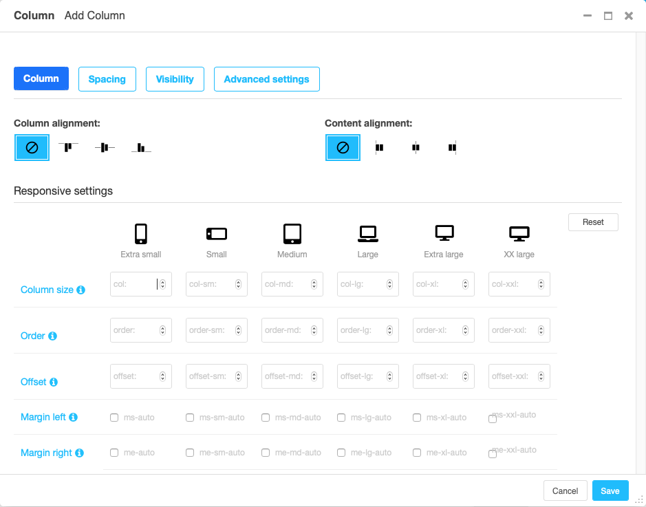

##############
 Grid plugins
##############

For details on how grids work, see, e.g. the `Bootstrap 5 documentation
<https://getbootstrap.com/docs/5.1/layout/grid/>`_.

.. index::
    single: Container

*********
Container
*********

A container is an invisible element that wraps other content. There are
in two types of containers:

Container
   All other containers restrict the width of their content depending on
   the used device.

Fluid container
   A fluid container occupies the full width available - no matter how
   wide the viewport (or containing) element is.

Full container
   A full container is like a fluid container and occupies the full width
   available. Additionally, it does not have a padding. Its content can
   therefore fill the entire area. Full containers are useful if you want
   to add a background color or shadow to another DOM element, like, e.g.,
   the contents of a column.

.. note::

    New feature:
        Containers can have a background color ("context"), opacity and shadow.

.. index::
    single: Row

.. _Grid plugins:

***
Row
***

A row contains one or more columns. By default columns are displayed
next to each other.

To automatically create not only a row but also some columns within that
row, enter the number of columns you will be using. You can always later
add more columns to the row or delete columns from the row.

Vertical aligned defines how columns of different height are
positioned against each other.

Horizontal alignment defines how columns **that do not fill an entire
row** are distributed horizontally.

.. note::

    New feature:

    The section "Row-cols settings" defines how many columns should be next
    to each other for a given display size. The "row-cols" entry defines the
    number of columns on mobile devices (and above if no other setting is
    given), the "row-cols-xl" entry the number of columns on a xl screen.

.. image:: screenshots/row.png

.. index::
    single: Column

******
Column
******

The column settings is largely about how much of the grid space the
column will use horizontally. To this end, the grid is divided in
(usually) 12 strips of equal width.

Auto sizing
   If no information on the column size is given, the column will be
   autosizing. This means that all autosizing columns of a row will
   occupy the same fraction of the space left, e.g. by sized columns.

Specifically sized columns
   If you enter a number the column for the specific screen size will
   exactly have the specified width. The unit of width is one twelfth of
   the surrounding's row width.

Natural width:
    If you need a column to take its natural width, enter ``0`` for its
    column size. This will display ``auto`` for columns size.

Also, you can adjust the vertical alignment of the specific column from
the row's default setting.

Finally, you can set the alignment of the content to left (right in a
rtl environment), center or right (left in a rtl environment). This
comes handy if, e.g., the column is supposed to contain centered
content.

.. note::

    Removed:
        The column type entry has been removed since it was a legacy from
        Bootstrap version 3.
