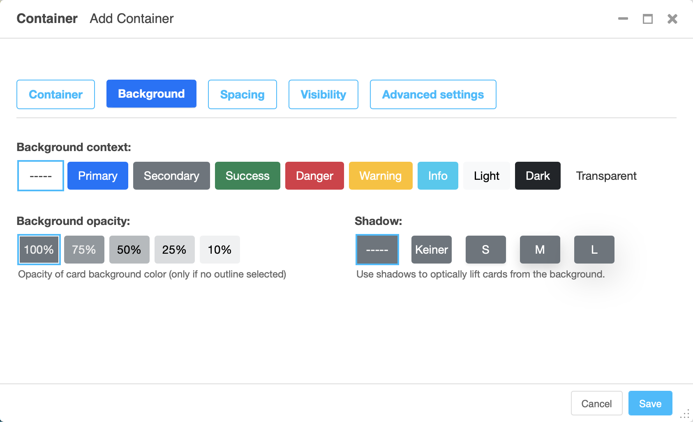

.. index::
    single: Plugins

########################
 Common plugin settings
########################

``djangocms-frontend`` offers a set of plugins to allow for an easy and clean
structure of your CMS contents.

All plugins are listed in the section "Frontend" when adding a plugin to
a placeholder:

Frontend editing of plugins has been desinged with three aims:

* Keep the essential editing required minimal and well-arranged on the editing
  forms.
* Eliminate the need for regularly adding html classes or other attributes like
  styles.
* Keep the possibility to change the html classes or tags in the rare case it
  is needed.

The editing has therefore been categorized in tabs starting with a plugin's
key tab for its most important information. Other tabs add general modifications
to the plugin, their availability depending on the plugin type. The well-known
"advanced settings" is available to all plugins, however, its use should in most
case be covered by the new other tabs:

Background tab
==============

The background tab allows to set a background context leading to the background
being colored appropriately.

The background properties can be modified by changing **opacity** and its ability
cast a **shadow**. Shadows allow the whole element to appear elevated from the
background.

Spacing tab
===========

The spacing tab is used to set margins and padding and to select which
devices they should be applied.

For both margin and padding the settings can be made independently for
horizontal and vertical padding.

Visibility tab
==============

The visibility tab controls on which devices the elements and its children
should be visible. Use this to design different content for different devices.

Advanced settings tab
=====================

The advanced tab lets you chose which tag (typically a ``div``) should be used
to render the element. You may also add attributes like additional classes as a
``class`` attribute, an ``id`` or styles in the ``style`` attribute.

.. warning::

    Using the advanced tab requires some technical knowledge on the sites
    installation, e.g., what css classes are available. This is why the advanced
    settings tab should only be used rarely. If you find yourself using it
    regularly, extending ``djangocms-frontend`` using a theme might be the more
    editor-friendly and more maintainable solution.

The advanced tab label carries a blue-ish dot to indicate that attributes are
set in the advanced settings tab. These attributes can change the appearance of
the element significantly which is why the dot reminds the editor that
there are advanced settings present.

Error indicators
================

In case the form is not valid when the user tries to save all fields that
are marked invalid will have an error message attached. Since not all fields
are visible in tabbed editing tabs containing an error have a red badge at
the upper right corner:

