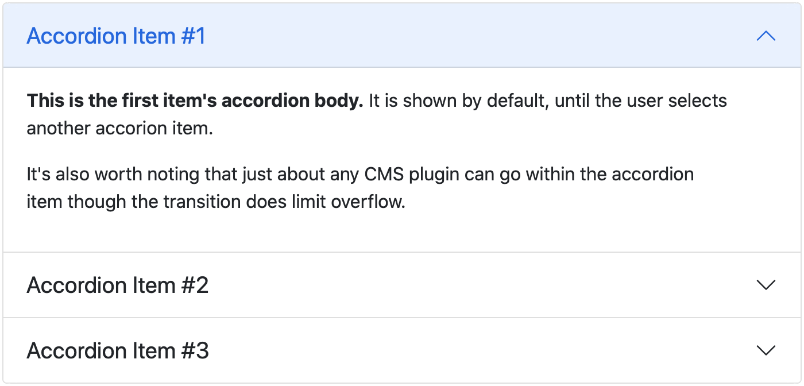
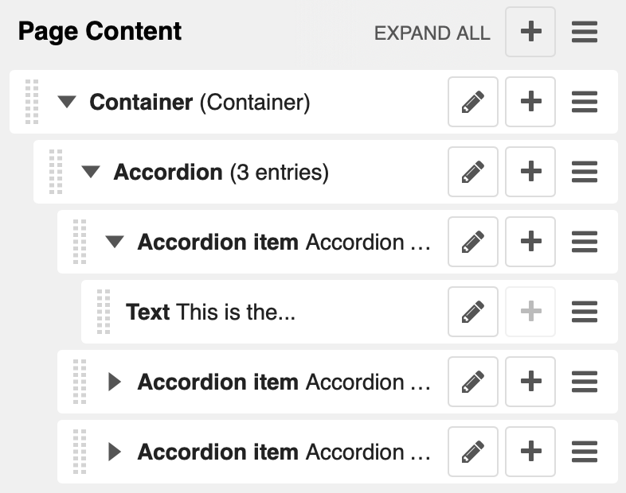
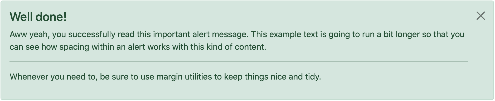
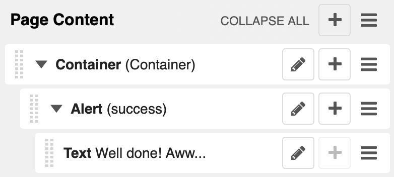
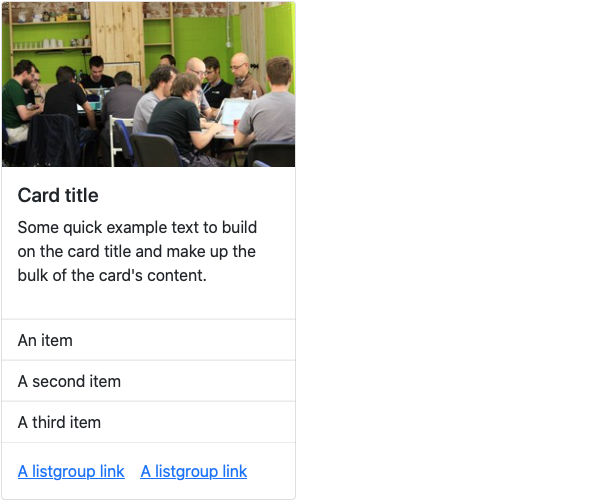
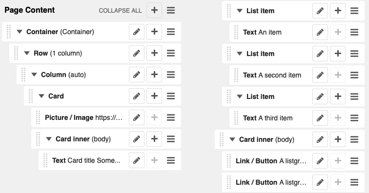
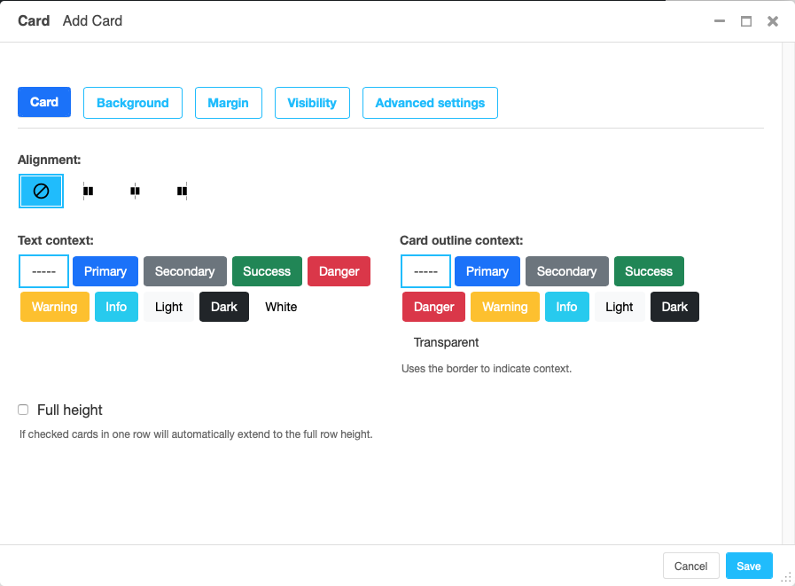
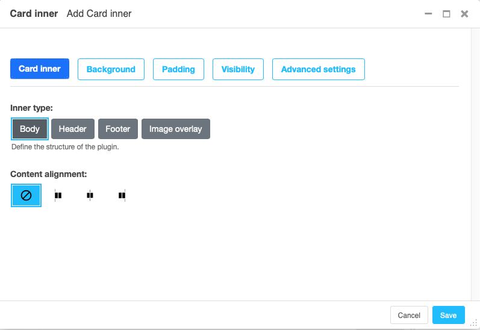
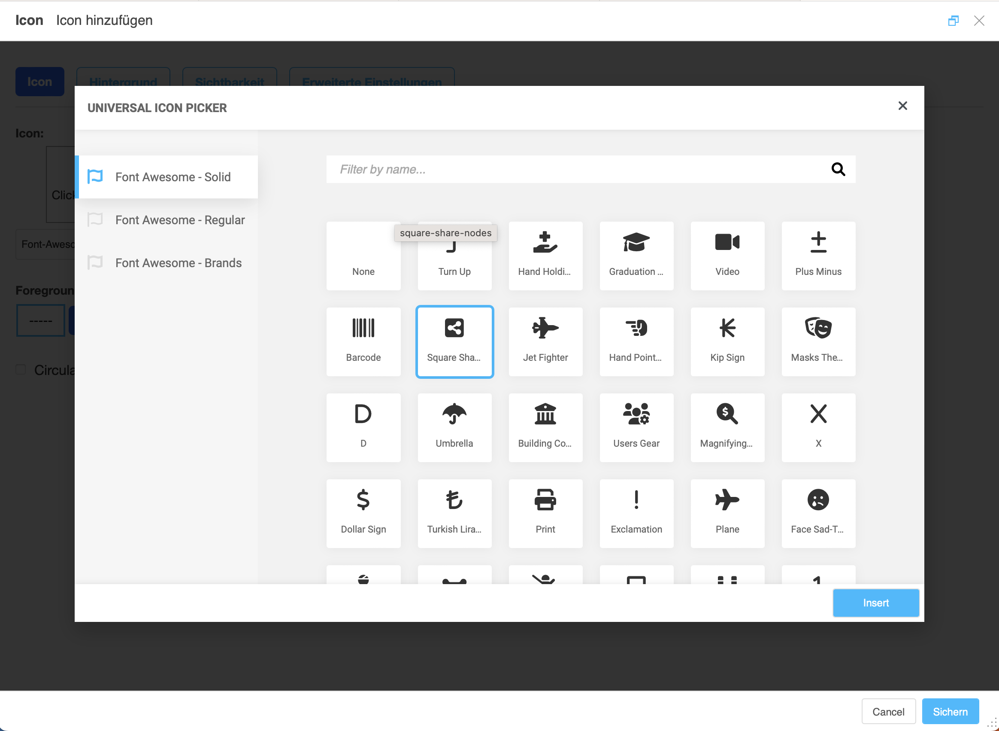

.. index::
    single: Plugins

#############################
 Pre-built component plugins
#############################

``djangocms-frontend`` adds a set of plugins to Django-CMS to allow for
quick usage of components defined by the underlying css framework, e.g.
Bootstrap 5.

While ``djangocoms-frontend`` is set up to become framework agnostic its
heritage from ``djangocms-bootstrap4`` is intentionally and quite visible.
Hence  for the time being, this documentation references the Bootstrap 5
documentation.

.. note::

    Custom components can easily be added using :ref:`custom_components`.

.. index::
    single: Accordion

*******************
Accordion component
*******************

Build vertically collapsing sections using accordions:

Accordions consist of an Accordion plugin which has an Accordion Item plugin for
each collapsable section.

Also see Bootstrap 5 `Accordion <https://getbootstrap.com/docs/5.3/components/accordion/>`_
documentation.

Re-usable component example
===========================

The accordion component is a good example of a re-usable component. It can be
used in all your project's templates. Here is an example of how to create an
accordion (if key word arguments are skipped they fall back to their defaults):

.. code-block::

    
    
        
            Content of accordion item 1
        
        
            Content of accordion item 1
        
    

.. index::
    single: Alert

***************
Alert component
***************

Alerts provide contextual feedback messages for typical user actions with a
handful of available alert messages.

Alerts can be marked dismissible which implies that a close button is added on
the right hand side.

.. note::

    New features:
        Alerts can have **shadows** to optically lift them.

Also see Bootstrap 5 `Alerts <https://getbootstrap.com/docs/5.3/components/alerts/>`_
documentation.

Re-usable component example
===========================

``djangocms-frontend`` plugins can be used as components. They can be
used in all your project's templates. Example (if key word arguments are
skipped they fall back to their defaults):

.. code-block::

    
    
        Alert text goes here!
    

.. index::
    single: Badge

***************
Badge component
***************

Badges are small count and labeling components usually in headers and buttons.

While often useful if populated automatically as opposed to statically in a
plugin, badges are useful, e.g., to mark featured or new headers.

Also see Bootstrap 5 `Badge <https://getbootstrap.com/docs/5.3/components/badge/>`_
documentation.

Re-usable component example
===========================

``djangocms-frontend`` plugins can be used as components. They can be
used in all your project's templates. Example (if key word arguments are
skipped they fall back to their defaults):

.. code-block::

    
    
        This content is ignored.
    

.. index::
    single: Card
    single: CardInner
    single: CardLayout

**************
Card component
**************

A card is a flexible and extensible content container. It includes options for
headers and footers, a wide variety of content, contextual background colors,
and powerful display options.

A card consists of the card wrapper itself, the Card Plugin. It can contain
one ore more instances of a Card Inner Plugin for header, body or footer, but
also potentially an Image Plugin for the card image or list group components.

The corresponding plugin tree is here:

Cards can be grouped by a **Card Layout component** offering the ability group
cards or display a grid of cards. The latter can be controlled by responsive
tools. If you need more granular responsive settings, please revert to
:ref:`Grid plugins <Grid plugins>` and build your own custom grid.

.. warning::

    djangocms-bootstrap4 Card Decks are not supported by `Bootstrap 5
    <https://getbootstrap.com/docs/5.1/components/card/#card-layout>`_.
    Card decks will be converted to grids of cards upon
    :ref:`Migrating from djangocms-bootstrap4`.

Card
====

The card resides in a Card plugin which allows for coloring, opacity and shadow
options.

Content is added to the card plugin by creating child plugins. These can be of
the type `Card inner`_, `Picture / Image`_, `List group`_, or Row.

.. note::

    New feature:
        By adding images or list groups directly to a card, unnecessary
        margins are avoided.

Card inner
==========

The Card Inner plugin allows to add the card header, body, footer or an overlay
space for a card image.

Here is an example of the new card **Image overlay** feature:

Also see Bootstrap 5 `Card <https://getbootstrap.com/docs/5.3/components/card/>`_
documentation.

Re-usable component example
===========================

``djangocms-frontend`` plugins can be used as components. They can be
used in all your project's templates. Example (if key word arguments are
skipped they fall back to their defaults):

.. code-block::

    
    
        
            <h4>Card title</h4>
        
        
            Some quick example text to build on the card title and make up the
            bulk of the card's content.
        
        An item
        A second item
        A third item
    

.. index::
    single: Carousel

******************
Carousel component
******************

A `Carousel <https://getbootstrap.com/docs/5.3/components/carousel/>`_
is a set of images (potentially with some description) that slide in
(or fade in) one after the other after a certain amount of time.

Each slide requires a Carousel Slide child plugin. The simplest case specifies
an image, potentially a caption and a link which is followed once the slide is
clicked.

Since the design of carousels is somewhat opinionated template sets can be
specified using the ``DJANGOCMS_FRONTEND_CAROUSEL_TEMPLATES`` setting.

.. note::

    A Carousel Slide plugin can have child plugins itself. If an image is
    specified the child plugins add to the caption. If no image is specified
    the child plugins make up the slide.

Re-usable component example
===========================

``djangocms-frontend`` plugins can be used as components. They can be
used in all your project's templates. Example (if key word arguments are
skipped they fall back to their defaults):

.. code-block::

    
    
        
            <h4>Carousel slide title</h4>
            
 Some more content...

        
        
            <h4>Carousel slide title</h4>
            
 Some more content...

        
    

Parameters for ```` are:

* ``template``: The template to use for the carousel. If not specified the
  default template is used.
* ``carousel_controls``: If set to ``True`` the carousel will have controls.
* ``carousel_indicators``: If set to ``True`` the carousel will have indicators.
* ``carousel_interval``: The interval in milliseconds between slides. If not
  specified the default interval (5000) is used.
* ``carousel_pause``: If set to ``hover`` the carousel will pause on hover.
* ``carousel_wrap``: If set to ``True`` the carousel will wrap around.
* ``carousel_keyboard``: If set to ``True`` the carousel will react to keyboard
  events.
* ``carousel_ride``: If set to ``True`` the carousel will start sliding
  automatically.
* ``carousel_aspect_ratio``: The aspect ratio of the carousel. If not specified
  the default aspect ratio (16:9) is used.

Parameters for ```` are:

* ``carousel_image``: The image to display in the slide. If not specified the
  slide will be empty.
* ``carousel_content``: The HTML caption to display in the slide.

******************
Collapse component
******************

The `Collapse <https://getbootstrap.com/docs/5.3/components/collapse/>`_
hides text behind its headline and offers the user a trigger (e.g., a
button) to reveal itself.

Compared to the accordion component the collapse component often is more
flexible but also requires more detailed styling.

.. index::
    single: Jumbotron

*******************
Jumbotron component
*******************

The jumbotron component is a large header, used e.g. as a page header. It has been
part of Bootstrap 4 and is still supported as a convenient way to generate page
headers.

.. note::

    The jumbotron header is not reflected by the table of contents component.

.. index::
    single: Link
    single: Button

***********************
Link / Button component
***********************

The link / button plugin creates a styled link or button (using the ``<a>``
HTML tag).

It is designed to allow for external and internal links. Internal links point
to a CMS page or pages of other Django applications. They are dynamic, i.e. if
the page's url changes (e.g. because it is moved in the page tree) all links
pointing to the page change accordingly.

If targets are deleted the link will fallback to regular text.

Re-usable component example
===========================

``djangocms-frontend`` plugins can be used as components. They can be
used in all your project's templates. Example (if key word arguments are
skipped they fall back to their defaults):

.. code-block::

    
    
    
        Click me!
    

********************
List group component
********************

List groups are a flexible and powerful component for displaying a series of
content. Modify and extend them to support just about any content within.

The component consists of a wrapper - ListGroup Plugin - and the items of the
list - ListGroupItem Plugin. If the list item is a link it suffices to insert
a Link Plugin directly as a child of the ListGroup Plugin.

List group
==========

The only setting is the list group flush setting. If checked, the list group will
be rendered without borders to blend into the surrounding element, e.g. a card.

List group item
===============

Simple content can be specified by providing "One line content". More complex content
of a list group item is rendered by child plugins. If child plugins are available
the "one line content" is ignored.

List group items can have a context (color), and three state: Regular, active and
disabled.

.. note::

    New feature:
        Links can be added to list groups and automatically are interpreted as list
        group items.

***************
Media component
***************

The media component is another legacy component from djangocms-bootstrap4.
``djangocms-frontend`` recreates it using responsive utilities.

.. index::
    single: Picture
    single: Image

.. _Picture / Image:

*************************
Picture / image component
*************************

The image or picture component make responsive picture uploads available as
well as responsive embedding of external pictures.

.. versionadded:: 1.2

   djangocms-text-ckeditor supports dragging and dropping images into a rich
   text field. If you add the following line to your `settings.py` file,
   djangocms-text-ckeditor will automatically convert an image dropped into it
   to a ``djangocms-frontend`` image component.

   .. code-block::

      TEXT_SAVE_IMAGE_FUNCTION = 'djangocms_frontend.contrib.image.image_save.create_image_plugin'

   Please note, that images dropped into djangocms-text-ckeditor are base64-
   encoded and take a quite a bit of band width. You may have to increase your
   `DATA_UPLOAD_MAX_MEMORY_SIZE` setting in `settings.py`.

   We recommend not using this feature but instead adding a image component
   through the "CMS Plugin" menu of Ckeditor.

.. index::
    single: Spacing
    single: Spacer

*****************
Spacing component
*****************

The spacing component provides horizontal and/or vertical spacing. If used without child
plugins it just provides the amount of space specified on the specified sides.

.. note::

    If no spacing is selected the spacing component can be used to individually
    style the content using the attributes fields in "Advanced Settings".

.. index::
    single: Blockquote

********************
Blockquote component
********************

Creates a ``<blockquote>`` tag.

.. note::

    New feature:
        Alternatively to the un-formatted quote text, child plugins can be used
        to fill the content of the blockquote.

.. index::
    single: Code

**************
Code component
**************

Have code snippets on your site using this plugin, either inline or as a code block.
``djangocms-frontend`` offers the `ace code editor <https://ace.c9.io>`_
to enter code bits.

.. warning::

    By default the ace code editor javascript code is retrieved over the internet
    from a cdn. If you do not want this to happen, e.g., for data privacy reasons
    or because your system is not connected to the internet, please use the
    weak dependency on `djangocms-static-ace <https://github.com/django-cms/djangocms-static-ace>`_
    by chaning your requirement from ``djangocms-frontend`` to
    ``djangocms-frontend[static-ace]`` and include
    ``"djangocms_static_ace"`` in your ``INSTALLED_APPS``.

.. index::
    single: Figure

****************
Figure component
****************

The figure component supplies a wrapper and a caption for a figure. The figure
itself is placed inside the figure component (as child plugins).

.. index::
    single: Tabs

**************
Tabs component
**************

.. note::

    Bootstrap 5 comes with a fade animation. Additional animations will have to
    be provided by you or a third party. If you use a CSS animation library,
    you can make these animations available by adjusting the
    ``DJANGOCMS_FRONTEND_TAB_EFFECTS`` setting.

Re-usable component example
===========================

``djangocms-frontend`` plugins can be used as components. They can be
used in all your project's templates. Example (if key word arguments are
skipped they fall back to their defaults):

.. code-block::

    
    
        
            <h4>Content of tab 1</h4>
            
 Some content...

        
        
            <h4>Content of tab 2</h4>
            
 Some more content...

        
    

Parameters for ```` are:

* ``template``: The template to use for the tabs. If not specified the default
  template is used.
* ``tab_type``: The type of the tabs. If not specified the default type is used.
* ``tab_align``: The alignment of the tabs. If not specified the default alignment
  is used.
* ``tab_index``: The index of the initially active tab. If not specified the
  first tab is active.
* ``tab_effect``: The effect of the tabs. ``"fade"`` is available. If not
  specified no effect is used.

Parameters for ```` are:

* ``tab_title``: The title of the tab.
* ``tab_bordered``: If set to ``True`` the tab will have a border.

.. index::
    single: Icon

**************
Icon component
**************

.. versionadded:: 1.1

djangocms-frontend's icon plugin supports a variety of popular icon fonts. The
icon component is centered around Gilles Migliori's
`universal icon picker <https://github.com/migliori/universal-icon-picker>`_.

A version of it is bundled with ``djangocms-frontend``. It currently contains
support for the following icon sets:

* `Bootstrap icons <https://icons.getbootstrap.com>`_
* `Elegant icons <https://www.elegantthemes.com/blog/resources/elegant-icon-font>`_ (bundled)
* `Feather icons <https://feathericons.com>`_ (bundled)
* `Fomatic UI icons <https://fomantic-ui.com/elements/icon.html>`_ (bundled)
* `Font awesome (regular, solid and brands) <https://fontawesome.com>`_
* `Foundation icons <https://zurb.com/playground/foundation-icon-fonts-3>`_ (bundled)
* `Material icons (filled, outlined, sharp, two-tone) <https://fonts.google.com/icons>`_
* `Open iconic <https://github.com/iconic/open-iconic>`_
* `Tabler icons <https://tabler-icons.io>`_
* Eric Flower's `Weather icons <https://erikflowers.github.io/weather-icons/>`_ (bundled)

.. note::

    The icon picker needs a config file for each icon set. This requires regular
    update. Please be patient if new icons do not appear immediately in
    djangocms-frontend's icon picker or - even better -
    `create a pull request! <https://github.com/django-cms/djangocms-frontend/>`_

.. warning::

    You may either use djangocms-icon or djangocms-frontent's icon contrib
    package but not both, since they both register an ``IconPlugin``.

Icon fonts
==========

As marked in the overview above, some MIT licenced icon fonts are bundled for
convenience. They are available to the web page through static files.

For other icon sets source files are loaded from CDN through the internet by
default. This is not necessarily a configuration you want to have in a production
situation. To specify where to get the required css files from please use the
:py:attr:`~settings.DJANGOCMS_FRONTEND_ICON_LIBRARIES` setting.

To just restrict the available choices of icon sets for the user use the
:py:attr:`~settings.DJANGOCMS_FRONTEND_ICON_LIBRARIES_SHOWN` setting.

Icons can be sized. Options for icon sizes are defined by the :py:attr:`~settings.DJANGOCMS_FRONTEND_ICON_SIZE_CHOICES` setting.

Adding custom icon fonts
========================

To add a custom icon font you need to generate a config file. This is a json
file that tells the icon picker which icons are available. As an example check
out the `config file for Bootstrap Icons <https://github.com/migliori/universal-icon-picker/blob/main/assets/icons-libraries/bootstrap-icons.json>`_::

    {
        "prefix": "bi bi-",
        "icon-style": "bi",
        "list-icon": "bi bi-badge1",
        "icons": [
            "123",
            "alarm-fill",
            "alarm",
            "align-bottom",
            "align-center",
            "align-end",
            ...
       ]
    }

Icons are rendered as ``<i>>`` tags with classes.

``.prefix`` defines a string that is prepended to all icons. For Bootstrap icons
that's the class ``bi`` and the prefix for the icon selecting class ``bi-``.

The list ``.icons`` contains all available icons in the set.

``.list-icon`` contains the classes for the example icon. You can probably ignore it.

``.icon-style`` currently is unused. It may in future determine how icons are
rendered. Currently all icons a re rendered by ``<i class"bla"></i>`` except
material design icon which are rendered by ``<i class="material-icon">bla</i>``.

Using svg sprites
=================

Currently only font-based icons are supported.

Icon plugins inside text plugins
================================

The icon plugin is text-enabled, i.e., you can add it to a text plugin through
djangocms-text-ckeditor's CKEDITOR. By default, however, CKEDITOR removes empty
```` or ``<i>`` tags which most icons use.

To disable this behavior of CKEDITOR, you need to add a ``customConfig`` entry
in ``CKEDITOR_SETTINGS``, e.g.,

.. code-block:: python

    CKEDITOR_SETTINGS = {
        ...,
        "customConfig": "icon/ckeditor.icons.js",
        ...,
    }

This will load the ``ckeditor.icons.js`` file which in turn will allow empty
``span``and ``i`` tags.

If you already have a ``customConfig`` file specified it will suffice to add
the following two lines to it.

.. code-block:: javascript

    CKEDITOR.dtd.$removeEmpty.span = 0;
    CKEDITOR.dtd.$removeEmpty.i = 0;

Finally, you potentially need to add the necessary icon css files to the
``contentCss`` property of ``CKEDITOR_SETTINGS``, e.g., for bootstrap icons
from their cdn

.. code-block:: python

    CKEDITOR_SETTINGS = {
        ...,
        "contentsCss": [
            ...,
            "https://cdn.jsdelivr.net/npm/bootstrap-icons@1.10.3/font/bootstrap-icons.css",
            ...,
        ],
        ...,
    }

**********
Navigation
**********

.. warning::

    The navigation plugin is still experimental. We believe for most use
    cases it is better to create custom navigation using the standard,
    template-based django CMS template tags like ``show_menu``.

    If your navigation deviates from you tree structure and needs to be managed
    by hand, you may want to consider using the navigation plugin.

The navigation plugin is a plugin that allows you to create a navigation. All navigation elements are
child plugins of the navigation plugin: The navigation plugin itself is just a
container for the navigation elements.

